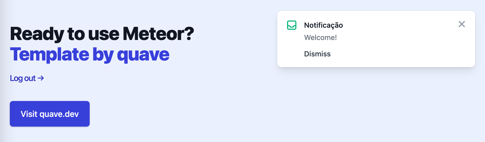

# quave:alert-react-tailwind

`quave:alert-react-tailwind` is a Meteor package that provides a plug-and-play alert system for React with TailwindCSS.

## Why

It is designed to simplify the process of showing alerts to users inside the app.

We are using `tailwindcss` styles.

We believe we are not reinventing the wheel in this package but what we are doing is like putting together the wheels in the vehicle :).

## Installation

```sh
meteor add quave:alert-react-tailwind
```

You should have the following npm dependencies in your project, the versions listed below are the tested versions:

- react@18.2.0
- react-dom@18.2.0
- react-router-dom@6.3.0
- @headlessui/react@1.7.0
- @heroicons/react@2.0.10

## Usage

### Configuration

You need to declare the context provider for the alerts, we recommend right after the Router from React Router, see `AlertProvider` in the example below:

```js
import React from 'react';
import { BrowserRouter as Router } from 'react-router-dom';
import { Routes } from './Routes';
import { AlertProvider, Alert } from 'meteor/quave:alert-react-tailwind';

// classnames tailwind alert:
// fixed inset-0 flex items-end px-4 py-6 pointer-events-none z-10 sm:p-6 sm:items-start w-full flex-col items-center space-y-4 sm:items-end transform ease-out duration-300 transition translate-y-2 opacity-0 sm:translate-y-0 sm:translate-x-2 translate-y-0 opacity-100 sm:translate-x-0 ease-in duration-100 max-w-sm bg-white shadow-lg rounded-lg pointer-events-auto ring-1 ring-black ring-opacity-5 overflow-hidden p-4 items-start flex-shrink-0 h-6 w-6 text-gray-400 text-red-500 text-green-500 ml-3 w-0 flex-1 pt-0.5 text-sm font-medium text-gray-900 mt-1 text-gray-500 mt-3 space-x-7 rounded-md text-indigo-600 hover:text-indigo-500 focus:outline-none focus:ring-2 focus:ring-offset-2 focus:ring-indigo-500 text-gray-700 hover:text-gray-500 ml-4 inline-flex sr-only h-5 w-5

export const App = () => (
  <Router>
    <AlertProvider>
      <div className="bg-indigo-50 h-full">
        <Alert />
        <div className="max-w-7xl mx-auto py-12 px-4 sm:px-6 lg:py-24 lg:px-8 lg:flex lg:items-center lg:justify-between">
          <Routes />
        </div>
      </div>
    </AlertProvider>
  </Router>
);
```

This alert is a small pop-over that will appear on top of the page. You need to render it somewhere in your app as well. See `Alert` in the example above. It is going to look like this:



### Tailwind

By default, we provide [tailwindcss](https://tailwindcss.com/) classes, you should include `safelist` property in your `tailwind.config.js`

```js

  safelist: [
    'bg-white',
    'duration-100',
    'duration-300',
    'ease-in',
    'ease-out',
    'fixed',
    'flex',
    'flex-1',
    'flex-col',
    'flex-shrink-0',
    'focus:outline-none',
    'focus:ring-2',
    'focus:ring-indigo-500',
    'focus:ring-offset-2',
    'font-medium',
    'h-5',
    'h-6',
    'hover:text-gray-500',
    'hover:text-indigo-500',
    'inline-flex',
    'inset-0',
    'items-center',
    'items-end',
    'items-start',
    'max-w-sm',
    'ml-3',
    'ml-4',
    'mt-1',
    'mt-3',
    'opacity-0',
    'opacity-100',
    'overflow-hidden',
    'p-4',
    'pointer-events-auto',
    'pointer-events-none',
    'pt-0.5',
    'px-4',
    'py-6',
    'ring-1',
    'ring-black',
    'ring-opacity-5',
    'rounded-lg',
    'rounded-md',
    'shadow-lg',
    'sm:items-end',
    'sm:items-start',
    'sm:p-6',
    'sm:translate-x-0',
    'sm:translate-x-2',
    'sm:translate-y-0',
    'space-x-7',
    'space-y-4',
    'sr-only',
    'text-gray-400',
    'text-gray-500',
    'text-gray-700',
    'text-gray-900',
    'text-green-500',
    'text-indigo-600',
    'text-red-500',
    'text-sm',
    'transform',
    'transition',
    'translate-y-0',
    'translate-y-2',
    'w-0',
    'w-5',
    'w-6',
    'w-full',
    'z-10',
  ]
```

or this comment somewhere in your code to avoid purging these classes:

```js
// classnames tailwind alert:
// fixed inset-0 flex items-end px-4 py-6 pointer-events-none z-10 sm:p-6 sm:items-start w-full flex-col items-center space-y-4 sm:items-end transform ease-out duration-300 transition translate-y-2 opacity-0 sm:translate-y-0 sm:translate-x-2 translate-y-0 opacity-100 sm:translate-x-0 ease-in duration-100 max-w-sm bg-white shadow-lg rounded-lg pointer-events-auto ring-1 ring-black ring-opacity-5 overflow-hidden p-4 items-start flex-shrink-0 h-6 w-6 text-gray-400 text-red-500 text-green-500 ml-3 w-0 flex-1 pt-0.5 text-sm font-medium text-gray-900 mt-1 text-gray-500 mt-3 space-x-7 rounded-md text-indigo-600 hover:text-indigo-500 focus:outline-none focus:ring-2 focus:ring-offset-2 focus:ring-indigo-500 text-gray-700 hover:text-gray-500 ml-4 inline-flex sr-only h-5 w-5
```


### Code usage

If you want to show an alert, you need to call `openAlert`, this function is produced by `useAlert` hook, see the example below:

```javascript
import React from 'react';
import { useNavigate } from 'react-router-dom';
import { Passwordless } from 'meteor/quave:accounts-passwordless-react';
import { useLoggedUser } from 'meteor/quave:logged-user-react';
import { useAlert } from 'meteor/quave:alert-react-tailwind';

import { RoutePaths } from '../general/RoutePaths';

export const Access = () => {
  const { openAlert } = useAlert();
  const { loggedUser } = useLoggedUser();
  const navigate = useNavigate();

  const onEnterToken = () => {
    navigate(RoutePaths.HOME);
    openAlert('Welcome!');
  };

  if (loggedUser) {
    return (
      <div className="flex flex-col items-center">
        <h3 className="text-lg px-3 py-2 text-base font-medium">
          You are already authenticated.
        </h3>
        <button onClick={() => navigate(RoutePaths.HOME)} type="button">
          Go Home
        </button>
      </div>
    );
  }
  return (
    <div className="flex flex-col items-center flex-grow">
      <Passwordless onEnterToken={onEnterToken} />
      <a
        onClick={() => navigate(RoutePaths.HOME)}
        className="mt-5 text-base font-medium text-indigo-700 hover:text-indigo-600 cursor-pointer"
      >
        <span aria-hidden="true"> &rarr;</span> Back to Home
      </a>
    </div>
  );
};
```

We produce other utility functions as well, see `AlertContext.Provider` value in the code if you have more complex use cases. You can also submit PRs adding more examples to this readme.

## Changes

If you want to keep your project up-to-date with the changes made here, read our [CHANGELOG](CHANGELOG.md).

## Limitations

N/A

### License

MIT
